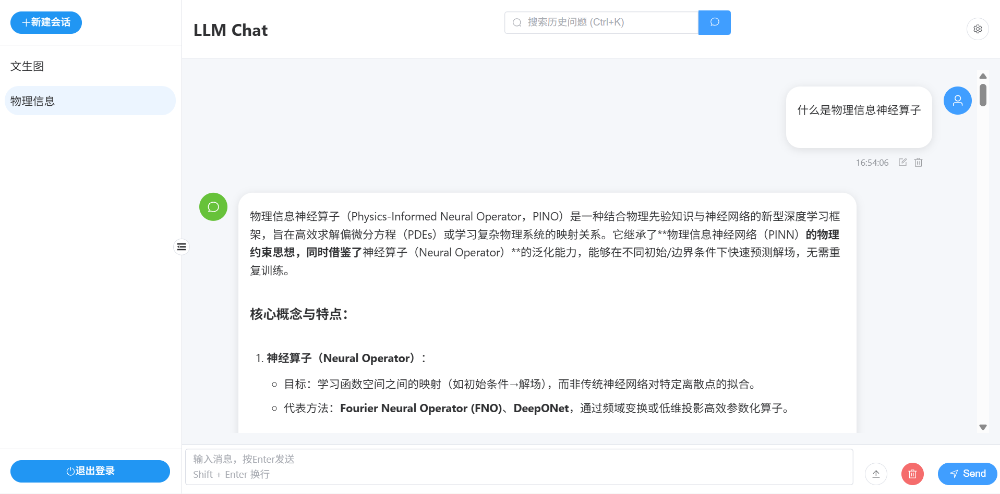
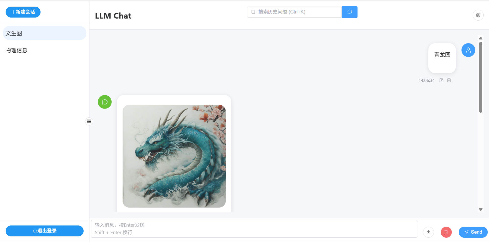
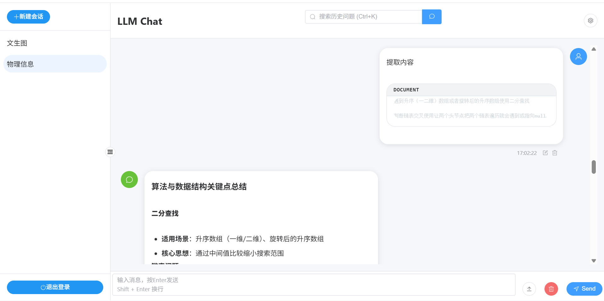

# LLM-Chat

基于 Vue3 + Vue Router + Express + MongoDB + Element Plus + TypeScript 的现代化 AI 聊天应用，支持多种大语言模型，提供流畅的对话体验。本项目采用 Monorepo 架构，包含完整的前后端实现。

## 特性

- 支持多种大语言模型 (DeepSeek R1/V3、Qwen系列、视觉模型、文生图模型等)
- 流式响应，实时显示 AI 回复
- 深色/浅色主题切换，UI界面圆角化
- 完整的 Markdown 支持，包括代码高亮
- 消息编辑、重新生成、复制等功能
- 对话搜索框，可以搜索历史
- 支持图片和文件上传，支持pdf、docx、txt等文件格式
- 采用双token验证，前端token过期后，自动刷新后端token
- 完整的用户鉴权与管理系统
- 引入虚拟滚动，优化长对话性能

## 快速开始

### 推荐 IDE 配置
- **编辑器**: [VSCode](https://code.visualstudio.com/)
- **插件推荐**:
  - [Vue - Official](https://marketplace.visualstudio.com/items?itemName=Vue.volar) (开发必备)
  - [TypeScript Vue Plugin](https://marketplace.visualstudio.com/items?itemName=Vue.vscode-typescript-vue-plugin) (增强类型检查)
  - [ESLint](https://marketplace.visualstudio.com/items?itemName=dbaeumer.vscode-eslint) (代码规范)
  - [Prettier](https://marketplace.visualstudio.com/items?itemName=esbenp.prettier-vscode) (代码格式化)

### 环境要求

- **Node.js**: 18.0+ (建议使用 LTS 版本)
- **包管理器**: [pnpm](https://pnpm.io/) 8.0+ (项目采用 Monorepo 架构，必须使用 pnpm)
- **数据库**: [MongoDB](https://www.mongodb.com/) 5.0+

### 安装与启动

```bash
# 1. 克隆项目
git clone <项目地址>

# 2. 进入项目目录
cd LLM-Chat

# 3. 安装依赖 (Monorepo 全局安装)
pnpm install

# 4. 配置环境变量
# 分别在 apps/server 和 apps/web 目录下创建 .env 文件并配置必要的 API Key 与 数据库连接
# 示例：apps/server/.env 需包含 MONGODB_URI, JWT_SECRET, SILICONFLOW_API_KEY 等

# 5. 启动项目
# 开发环境：前后端同时启动
pnpm dev

# 仅启动前端
pnpm dev:web

# 仅启动后端
pnpm dev:server
```

### 获取API密钥：[siliconflow网址](https://siliconflow.cn/zh-cn/)

## 技术栈

### 前端
- Vue 3 - 渐进式 JavaScript 框架
- Vite - 现代前端构建工具
- Element Plus - Vue 3 组件库
- Pinia - Vue 状态管理
- Markdown-it - Markdown 渲染
- Highlight.js - 代码语法高亮

### 后端
- Node.js - 运行时环境
- Express - Web 应用框架
- Mongoose - MongoDB 对象建模工具

### 架构
- Monorepo - 单仓库管理 (pnpm workspace)
- TypeScript - 静态类型检查

## 项目结构

```text
.
├── apps/
│   ├── web/                  # 前端应用 (Vue 3 + Vite)
│   │   ├── src/
│   │   │   ├── components/   # 可复用 UI 组件 (聊天框、搜索栏、设置面板等)
│   │   │   ├── views/        # 页面视图 (聊天主界面、登录注册页)
│   │   │   ├── stores/       # Pinia 状态管理 (用户信息、对话状态、全局设置)
│   │   │   ├── router/       # 路由配置 (包含全局路由守卫、登录鉴权)
│   │   │   └── utils/        # 工具类 (Markdown 渲染、API 请求封装、消息处理)
│   │   └── vite.config.ts    # 前端构建与代理配置
│   │
│   └── server/               # 后端服务 (Node.js + Express)
│       ├── src/
│       │   ├── controllers/  # 业务逻辑层 (用户鉴权、对话管理、API 转发)
│       │   ├── models/       # 数据模型 (MongoDB/Mongoose 用户与聊天 Schema)
│       │   ├── routes/       # API 路由定义 (RESTful 风格)
│       │   ├── middleware/   # 中间件 (JWT 身份验证、错误处理)
│       │   └── index.ts      # 入口文件 (服务器启动、数据库连接)
│       └── .env.example      # 环境变量示例文件
│
├── packages/
│   └── shared/               # 前后端共享代码
│       ├── index.ts          # 统一导出接口与常量
│       └── package.json      # 共享包配置
│
├── README.md                 # 项目说明文档
├── pnpm-workspace.yaml       # Monorepo 工作区配置
└── package.json              # 根项目配置 (脚本聚合)
```

## 配置说明

在设置面板中可以配置以下参数：

- API 密钥 - 用于访问 AI 接口
- 模型选择 - 支持多种 AI 模型
- Temperature - 控制回答的随机性 (0-1)
- Top P - 控制词汇采样范围
- Top K - 控制词汇选择数量
- Frequency Penalty - 重复文字惩罚
- 最大 Token - 限制回答长度
- 流式响应 - 开启/关闭打字机效果

## 效果图
插入images文件夹的图片



